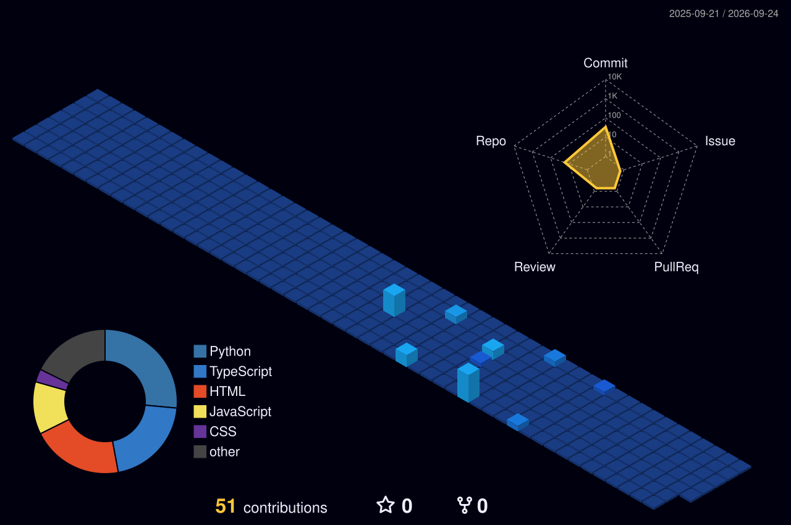

<!-- Hero Section with Glowing Waving Banner -->

  

<!-- 3D Cinematic Workspace Animation -->

  

  <!-- Typing text animation with portfolio colors -->
  

  

---

### 💫 About Me
I'm a beginner software developer who loves building programs that bridge technology and daily life. My coding journey is focused on exploring **Artificial Intelligence (AI), Deep Learning, Data Analysis**, and **Software Engineering**. I enjoy bringing logic and clean design together.

* 🧠 **My Aim**: To learn and grow step-by-step in AI/ML, SDE, and Full Stack Development.
* 🌱 **Currently Studying**: Building smart neural networks and interactive web management portals.
* ⚡ **Fun Fact**: I like clean, dark-mode themes, lofi coding, and 3D computer art.

---

### 🛠️ Technical Toolbox

  <!-- Interactive-looking Skill Icons Grid matching dark theme -->
  

---

### 📂 Featured Projects (First Steps & Learning)

<table width="100%">
  <tr>
    <td width="50%" valign="top">
      <h4>🧠 AI & Deep Learning</h4>
      <ul>
        <li>
          <b><a href="https://github.com/Addanki-surya11/Skin-Cancer-Detection">🔬 Skin Cancer Detection</a></b>
           <i>Python • ResNet • XGBoost</i>
          
A deep learning model trained on dermatological images to categorize skin conditions. Perfect for understanding neural network features and classification algorithms.

        </li>
        <li>
          <b><a href="https://github.com/Addanki-surya11/HIRE-FIT-AI">💼 HIRE-FIT-AI</a></b>
           <i>Python • NLP • Scikit-Learn</i>
          
An automated resume parser that scans applicant text and scores candidate qualifications against job requirements to help recruiters save time.

        </li>
        <li>
          <b><a href="https://github.com/Addanki-surya11/Chat-bot-creation">🤖 Chatbot Creation</a></b>
           <i>Python • NLP • NLTK</i>
          
A rule-based dialogue agent to practice text tokenization, keyword matching, and basic conversational flows.

        </li>
      </ul>
    </td>
    <td width="50%" valign="top">
      <h4>🌐 Web & Data Engineering</h4>
      <ul>
        <li>
          <b><a href="https://github.com/Addanki-surya11/SMART-MESS">🍱 SMART MESS</a></b>
           <i>HTML • CSS • JS • Node.js</i>
          
A complete hostel food tracking web app. Features independent Admin and Student dashboards, meal slot booking, and a QR code scanner for instant verification.

        </li>
        <li>
          <b><a href="https://github.com/Addanki-surya11/stock-market-predictor">📈 Stock Market Predictor</a></b>
           <i>Python • Pandas • Regression</i>
          
A predictive model that uses historical price charts to forecast future stock patterns, serving as my first step into data regression and graphing.

        </li>
        <li>
          <b><a href="https://github.com/Addanki-surya11/Weather-Forecast-App">⛅ Weather Forecast App</a></b>
           <i>JavaScript • HTML5 • CSS3</i>
          
A neat weather portal that uses public API requests to display live weather conditions and forecasts for any city.

        </li>
      </ul>
    </td>
  </tr>
</table>

---

### 🌃 3D Contribution City View

  <!-- yoshi389111/github-profile-3d-contrib renders this 3D bar chart city automatically -->
  

---

### 🎮 Contribution Snake Game (Animated)

  <!-- Platanes/snk workflow generates this animated snake game -->
  

---

### 📊 GitHub Analytics

  
  &nbsp;&nbsp;
  

  

---

### 🤝 Let's Collaborate!

  
  &nbsp;&nbsp;
  
  &nbsp;&nbsp;
  

